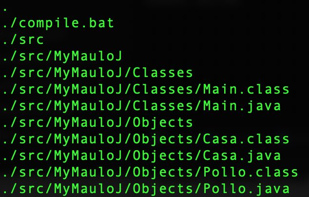

# Java Programs
## by [Antonio Maulucci](https://sites.google.com/view/antomau "Antonio Maulucci")


In this repo you can find my programs written in Java. You can use it to learn Java or to know how to program it.

    System.out.println("Hello, World!");


----------
## Argomenti:
 - argomenti di base
 - Classi
 - Struttre dati
 - I/O su file
 - *altro*

----------

|  | See the **java-master.zip** file to have more programs! |
|--|--|

----------

## Compile manually...

directory:



`$ cd {path}/directory `

```bash
javac -cp .\src\ .\src\MyMauloJ\Objects\Pollo.java
javac -cp .\src\ .\src\MyMauloJ\Classes\Main.java
cd src

java -cp . MyMauloJ.Classes.Main
```

------------


### How to edit *.md files

to edit *.md files you can use:

[Pandao](https://pandao.github.io/)
[Classeur](https://app.classeur.io)
[StackEdit](https://stackedit.io)
[Dillinger](http://dillinger.io/)
[Dillinger CheatSheet](https://github.com/adam-p/markdown-here/wiki/Markdown-Cheatsheet)
[LearnXinYminutes](https://learnxinyminutes.com/docs/it-it/markdown/)


